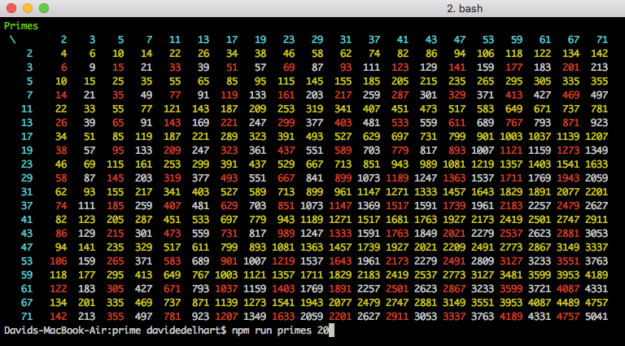

## Primes

this program outputs a multiplication table where the row and column factors are prime series.

## environment

Node.js must be installed for this program to run; tested under version 4.2.

To install, run `npm install`.

To execute run `npm run primes` (for a default list of 10) or `npm run primes 15` (or any other number) for more/less primes. 

To execute tests run `npm test`. 

It uses [Trial Division](https://en.wikipedia.org/wiki/Prime_number). 

### Methods 

#### isPrime(int):bool

tests if a given number is prime. Throws error on non-intrgral/non-positive input

#### class PrimeList(size: int)

Creates a list of primes; the requested quantity of primes are available in the `.numbers` property.
Upon construction it iterates from 1 and up, until it has found (count) values.

The largest / last prime in the series is exposed as `.lastPrime`. 

#### KnownPrimes

Used for test validation; loads `primes.json`, an array of primes, and exposes three properties:

* primeNumbers, the values found in primes.json's primes property
* LAST_PRIME is the last prime in that series
* notPrimeNumbers, numbers from 1...LAST_PRIME that are not present in primeNumbers.